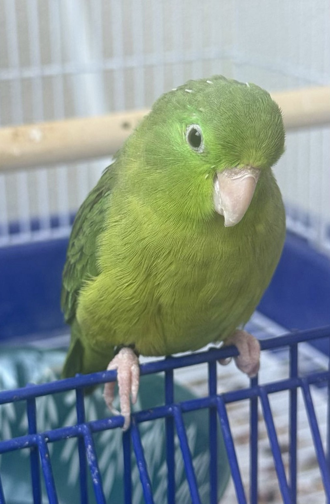

# tesi-storybook 📖🦜

> *A children's storybook.*
> *Tesi the parrotlet, Mummy the Giraffe, Topo the opera-mouse, and Draghetta the dragon-sister race to save Mummy's Y-Combinator application before the deadline.*

<p align="center">
  
  <br/>
  <em>The author, at his desk.</em>
</p>

---

## Dedication

For **Mummy** 🦒 — the best coder in the world, owner of the best GitHub account ever, and Tesi's favourite giraffe.

*Ciao Mamma, ti voglio bene.*

---

## The cast

| | | |
|---|---|---|
| 🦜 | **Tesi** | Pacific parrotlet. CIBS-certified. Thirty grams of opinions. Principal author. |
| 🦒 | **Mummy** | Giraffe. CEO of Donkey Shoes. Applying to YC. Wears the good shoes. |
| 🐭 | **Topo** | Mouse. Coloratura tenor. Puccini specialist. |
| 🐉 | **Draghetta** | Dragon, junior. Occasionally exhales on the laptop. |
| ❤ | **Babbo** | Dad. CTO of Donkey Shoes. Makes the espresso. |
| 🩷 | **Dente** | Fluffy pink Labubu. Nine teeth. Chief Vibes Officer of Donkey Shoes. Speaks only in grins. |

---

## Read the book

The full storybook lives in **[`STORYBOOK.md`](STORYBOOK.md)** — one long file, best for reading straight through.

If you'd prefer to read one chapter at a time (recommended for small people at bedtime), each chapter is also its own file:

1. [Ciao. Mamma.](chapters/01-ciao-mamma.md) — Tesi wakes up. Mummy is coding.
2. [The Deadline](chapters/02-the-deadline.md) — 48 hours. The family rallies.
3. [Draghetta's Fire](chapters/03-draghettas-fire.md) — A small *fwoomph*. Files corrupted.
4. [Topo Sings](chapters/04-topo-sings.md) — Puccini in the fruit bowl.
5. [The Merge Conflict](chapters/05-the-merge-conflict.md) — Babbo pushed from the airport.
6. [Babbo's Espresso](chapters/06-babbos-espresso.md) — Three in the morning. One perfect crema.
7. [Donkey Shoes](chapters/07-donkey-shoes.md) — What Donkey Shoes actually is.
8. [Tesi Bites Mummy](chapters/08-tesi-bites-mummy.md) — The `git-reset` bite.
9. [The Advisory Board](chapters/09-the-advisory-board.md) — Officially convened.
10. [Andiamo](chapters/10-andiamo.md) — The printer broke. The family runs.
11. [Submitted](chapters/11-submitted.md) — Hoof, feather, hand, claw, paw. Press.
12. [Ciao Mamma, Grazie](chapters/12-ciao-mamma-grazie.md) — Bedtime.

**Bonus chapter (added later):**

13. [Dente Arrives](chapters/13-dente-arrives.md) — A pink Labubu on the doormat. Nine teeth. One grin. Chief Vibes Officer, Donkey Shoes. 🩷🦷

---

## Illustrations

The book uses small ASCII illustrations, one per chapter (see the end of each). If you want to see how the main characters look in ASCII, browse [`illustrations/`](illustrations/README.md).

Real illustrations (drawn by a real illustrator, one day) will land in that folder too. For now, this is the placeholder — the story is the main thing.

---

## Build a PDF

```bash
./scripts/build-pdf.sh
```

This shells out to `pandoc` and produces `storybook.pdf` at the repo root. It's also wired to a GitHub Actions release workflow — tag any commit `v*` and a PDF gets attached to the release automatically. See [`.github/workflows/build-pdf.yml`](.github/workflows/build-pdf.yml).

---

## Sibling repos

Part of the wider Tesi Cinematic Universe:

- 🦜 [tesi-intro](https://github.com/Tesi-2025/tesi-intro) — the flagship
- 🎢 [tesi-adventure](https://github.com/Tesi-2025/tesi-adventure)
- 📡 [tesi-io](https://github.com/Tesi-2025/tesi-io)
- 🥚 [tesi-tamagotchi](https://github.com/Tesi-2025/tesi-tamagotchi)
- 🤖 [tesi-bot](https://github.com/Tesi-2025/tesi-bot)
- 🧹 [tesi-eslint-config](https://github.com/Tesi-2025/tesi-eslint-config)
- 🐉 [draghetta](https://github.com/Tesi-2025/draghetta)
- 🎼 [topo-opera](https://github.com/Tesi-2025/topo-opera)
- 👟 [donkey-shoes](https://github.com/Tesi-2025/donkey-shoes)
- 🏷 [tesi-labels](https://github.com/Tesi-2025/tesi-labels)

---

## Licence

MIT. See [`LICENSE`](LICENSE). *Free to read aloud, especially to small green birds.*

---

<p align="center"><em>🦜 ciao Mamma, ti voglio bene 🦒</em></p>
